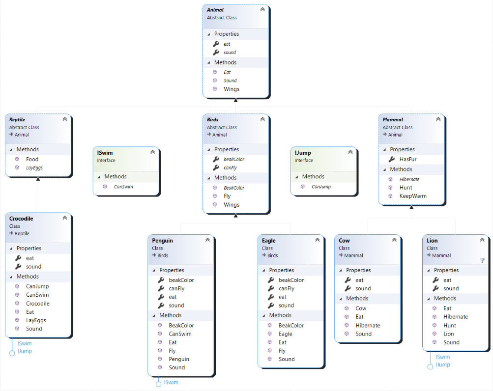
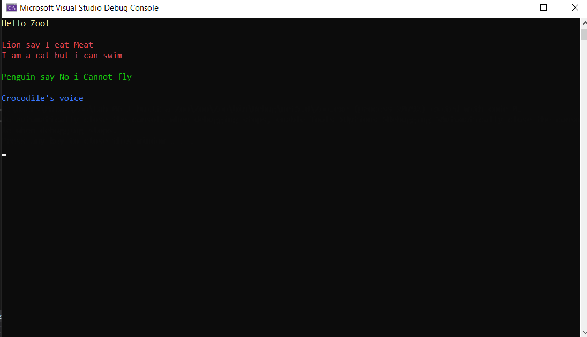
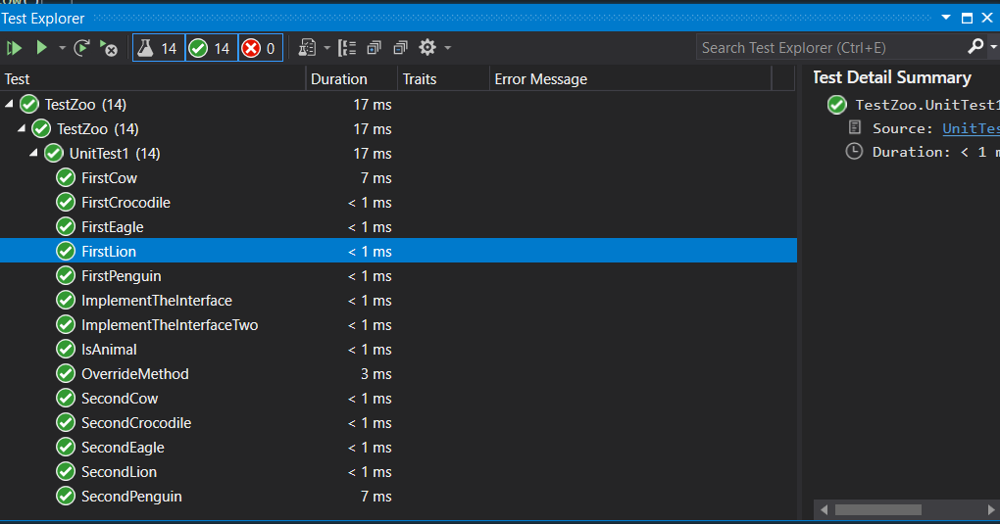

# Lab-06-I-built-a-Zoo

## Description
This is a console applocation that simulates a zoo using classes and Object-Oriented Programming (OOP).

## Explanation of OOP Principles
1. Abstraction: It allows making relevant information visible. Abstract classes are non-instantiable classes.

2. Inheritance: The class that inherits the members of the base class is called the derived class. This allows derived class to inherit properties from base methods.

3. Encapsulation: Encapsulation is defined 'as the process of enclosing one or more items within a physical or logical package'. Encapsulation, in object oriented programming methodology, prevents access to implementation details. (e.g., public, private, protected, etc.).

4. Polymorphism: It is the ability of objects of different types to provide a unique interface for different implementations of methods. It is usually used in the context of late binding, where the behavior of an object to respond to a call to its method members is determined based on object type at run time. It allows virtual properties and methods in base classes to be overridden in children or derived classes.

## Interface
In C#, a class can only inherit from one type but can implement many interfaces. So interfaces allow you to fulfill multiple contracts in one class.

Interface helps a class to include behavior from multiple sources. C# is an object oriented language and it does not support multiple inheritance of classes.

Interface can contain methods, properties, events, indexers or any combination of these members.

***This console application has two interfaces***

1. ISwim 
* Implemented in Lion.cs, Penguin.cs and Crocodile.cs
```
public string CanSwim()
        {
            return "I am a cat but i can swim";
        }
```

2. IJump
* Implemented in Lion.cs and Crocodile.cs
```
public string CanJump()
        {
            return "I can jump more than 2 metters";
        }
```

## Class Diagram


## ScreenShot


---

